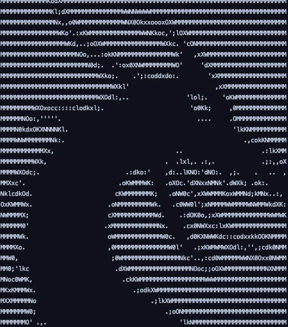
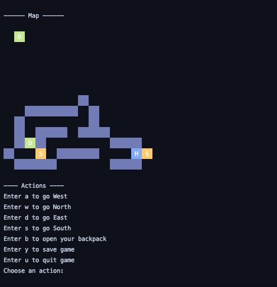

# A-Mazeing-Dungeon
> Console based game inspired by the Dungeon Maze game.

## General info
Group project exercise 

## Screenshots

## Technologies
* Java 11

## Setup
Import to optional IDE.

## Code Examples
`private boolean moveHeroEast() {
    if (this.maze.isARoom(this.hero.eastOfHero()) && this.hero.getCol() < this.maze.getMaze()[0].length - 1) {
        this.maze.removeHeroFromMapAndMaze(this.hero);
        this.hero.moveEast();
        return true;
    } else {
        System.out.println("There is a wall in the way.");
        return false;
    }
}

private boolean moveHeroNorth() {
    if (this.maze.isARoom(this.hero.northOfHero()) && this.hero.getRow() > 0) {
        this.maze.removeHeroFromMapAndMaze(this.hero);
        this.hero.moveNorth();
        return true;
    } else {
        System.out.println("There is a wall in the way.");
        return false;
    }
}

private boolean moveHeroSouth() {
    if (this.maze.isARoom(this.hero.southOfHero()) && this.hero.getRow() < this.maze.getMaze().length - 1) {
        this.maze.removeHeroFromMapAndMaze(this.hero);
        this.hero.moveSouth();
        return true;
    } else {
        System.out.println("There is a wall in the way.");
        return false;
    }
}
`

## Features
* Fight enemies
* Buy weapons
* Find potion
* Move player
* Map
* Save/Load game
* Graphics
* Level up
* Sound

## Status
Project is:_finished_

## Contact
Created by Alex, Chiharu, Mantas, Victor and Patrik - feel free to contact us!
